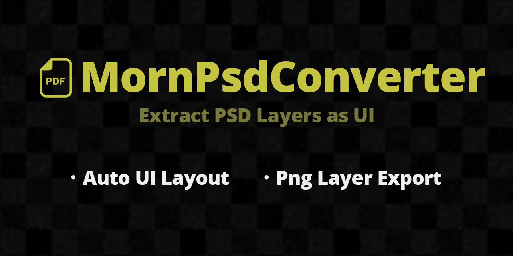

# MornPsdConverter

<p align="center">
  
</p>

<p align="center">
  
</p>

## 概要

PSD ファイルのレイヤーを PNG エクスポート・Canvas 配下に UI Image として配置するエディタツールです。
PSD を直接パースしてレイヤー座標を取得し、正確な位置に配置します。

## 導入方法

Unity Package Manager で以下の Git URL を追加:

```
https://github.com/TsukumiStudio/MornPsdConverter.git
```

## 使い方

Project ウィンドウで PSD ファイルを右クリック → `Assets > PSD to UI` から選択:

| メニュー | 説明 |
|---|---|
| **レイヤーをPNGエクスポート** | 各サブスプライトを個別 PNG として書き出し |
| **レイヤーをPNGエクスポート + UIに展開** | PNG エクスポート後、Canvas 配下に Image として配置 |
| **UIに展開 (サブスプライト方式)** | PSD のサブスプライトを直接参照して配置 (事前に Sprite Mode = Multiple が必要) |

## 機能

- **Built-in PSD Parser** — 外部ツール不要で PSD のレイヤー情報を読み取り
- **PNG Layer Export** — 各レイヤーを個別 PNG ファイルとしてエクスポート
- **Auto UI Placement** — レイヤーの元座標・サイズを忠実に再現して配置
- **Sub-Sprite Mode** — Unity の PSD インポーターを直接利用するモード
- **Unicode Layer Names** — 日本語レイヤー名を正しく取得
- **Undo Support** — 生成した UI オブジェクトを Undo で元に戻せる

## ライセンス

[The Unlicense](LICENSE)
